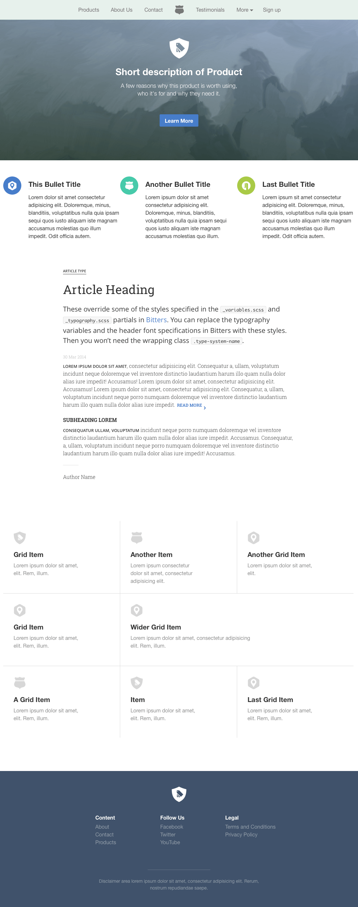

# Bourbon example
[Bourbon](http://bourbon.io/), [Neat](http://neat.bourbon.io/), [Bitters](http://bitters.bourbon.io/), [Refills](http://refills.bourbon.io/) usage example.  
This example is based on 「[Awesome CSS with Bourbon, Neat, Bitters & Refills!](https://www.youtube.com/playlist?list=PLfdtiltiRHWErI0VSxDCbeDyEJm_kVt3p)」 


## Preview


## Getting Started
#### Install gems
```
$ gem install sass
$ gem install bourbon
$ gem install neat
```

#### Install Borbon, Neat, Bitters
```
$ cd css/0-plugins
$ bourbon install
$ neat install
$ bitters install
```

#### Compile
```
$ cd css
$ sass --watch app.sass:app.css
```

#### Run
```
$ python -m http.server
```

#### Debug settings
Edit  `neat/settings/` files.
